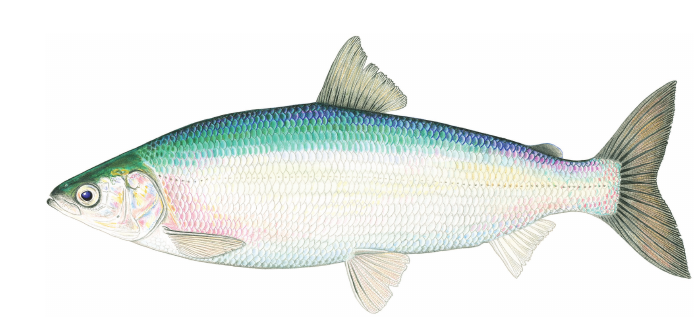
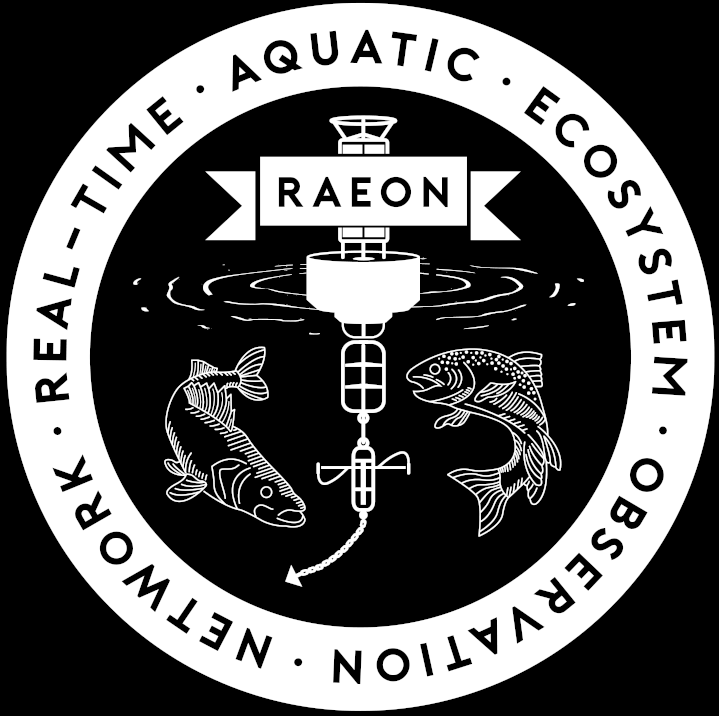
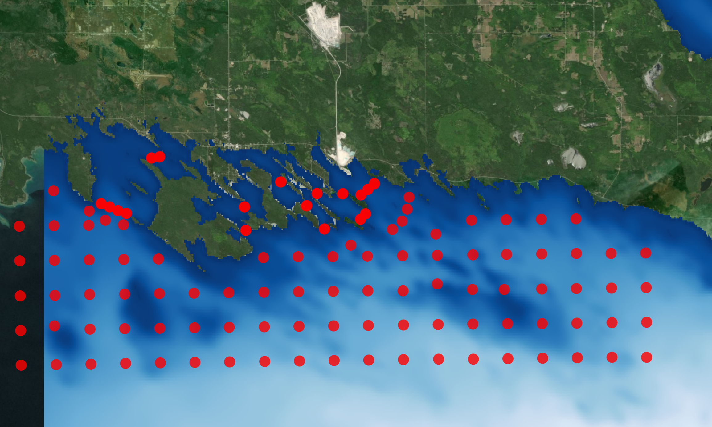
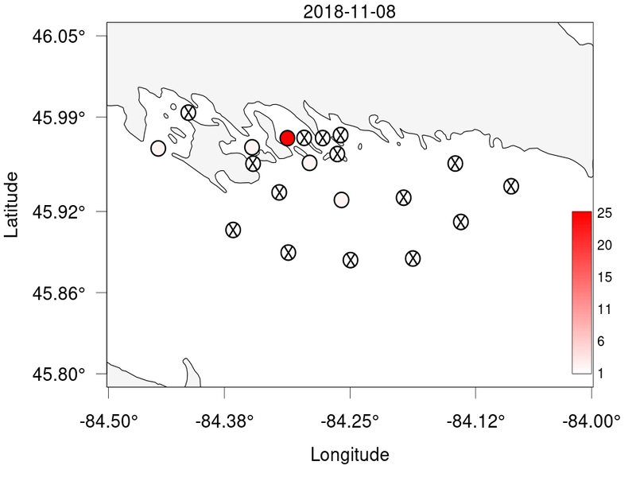
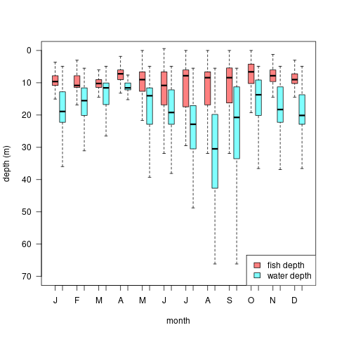
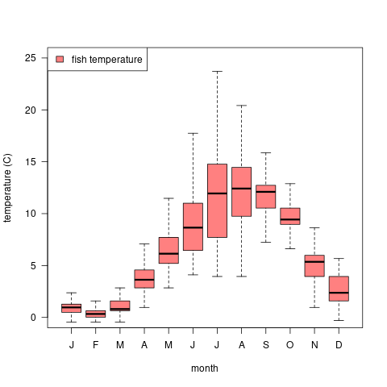
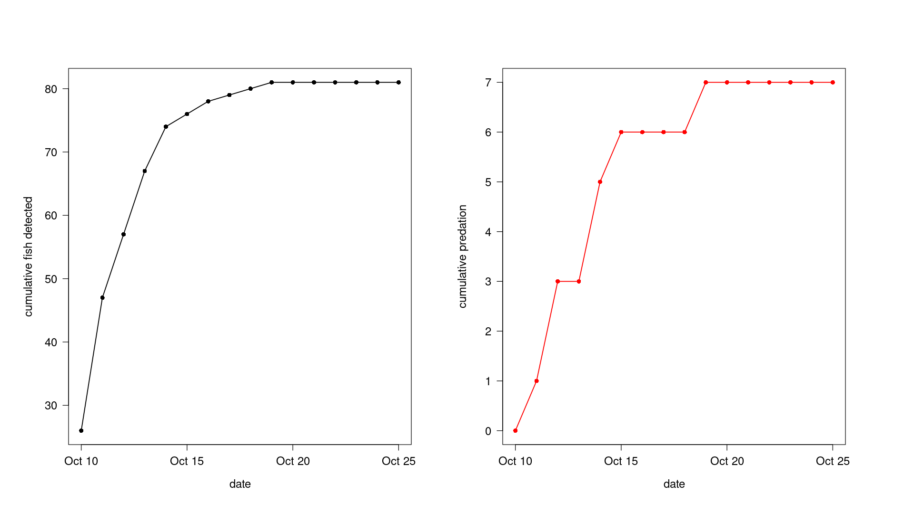

```{r xaringanExtra, echo = FALSE}
xaringanExtra::use_freezeframe(overlay = TRUE, responsive = FALSE)
```

class: title-slide, center

<!-- see for helpful tips:
https://nbisweden.github.io/raukrtemplate/presentation_demo.html#1
https://github.com/yihui/xaringan/wiki
-->


# Les Cheneaux Island and Saginaw Bay cisco project update

</br>

## Todd Hayden, Chris Holbrook, Dave Fielder, Kevin McDonnell, Tom Binder, Aaron Fisk

.center[]


<div class="flex2">
   
   
   
   
   
   
</div>

---
class: top, center
 
# History
 
.left-column[
.left[
- 2019 autumn
]
]

.right-column[
.left[
- 100 tags, tagged 42 Hessel, 7 Government Bay
- 120 receiver array
]

.left[]
]
---

class: top, center
 
# History
 
.left-column[
- .left[2019 autumn]
- .left[2020 winter]
]

.right-column[
.left[
- tagged 39 cisco, gill nets under ice


.left[
<div class="flex2">
	
	
</div>
]
]
]

---

class: top, center
 
# History
 
.left-column[
- .left[2019 autumn]
- .left[2020 winter]
- .left[2020 autumn]
]


.right-column[
.left[
- 100 new tags, 12 leftover, tagged 60 fish Government Bay, 9 fish Hessel
]

.left[
<video width="570" height="470" autoplay loop muted>
	<source src="tagged_cisco_in_recovery_01_cholbrook_20181108.mp4" type="video/mp4"/>
<!-- <source src="tagged_cisco_in_recovery_01_cholbrook_20181108.mp4" type="video/mp4"/> -->
	</video>
]
]

---
class: top, center
 
# History
 
.left-column[
- .left[2019 autumn]
- .left[2020 winter]
- .left[2020 autumn]
- .left[2021 autumn]
]

.right-column[
.left[
- Tagged 48, Government Bay
- All tags in fish!
]

.left[

]
]

---

class: top, center
 
# Objectives
 
.left[
 
- Describe habitat use and estimate proportion of cisco that move to main basin of Lake Huron
- Determine timing and spatial extent of post-spawning movements
- Determine annual survival and spawning site fidelity
- Determine timing of movement onto spawning grounds

]

.center[

]
---
class: top, center

# Depth and Temperature experience

.pull-left[

]

.pull-right[

]

---

class: top, center

# Conclusions
.left[
- Extensive movements, main basin- summer/autumn
- Overwinter in islands
- Depth experienced: 0-30 m, median 7-11 m
  - fish suspended during summer (movement offshore)
- Temperature range (median 0-20 C)
- Cailin Burnmaster (U Windsor)- MS project

]

<center>

</center>

---

class: title-slide, center

<!-- see for helpful tips:
https://nbisweden.github.io/raukrtemplate/presentation_demo.html#1
https://github.com/yihui/xaringan/wiki
-->


# Movement and survival of hatchery juvenile cisco in Saginaw Bay

</br>

## Todd Hayden, Chris Holbrook, Tom Binder, Andrew Honsey, Roger Gordon, Kevin McDonnell, Dave Fielder, Aaron Fisk

.center[]


<div class="flex2">
   
   
   
   
   
   
</div>

---

class: top, center
 
# Can juvenile cisco be tagged? 
.left[
- 2020 pilot tagging study (HBBS)
  - 75% survival 3 weeks
  - V5-180kHz tags fit (fish ~140 mm TL)
- 2021 GLFC Pilot Project ~$20K
  - 60 receiver array in Saginaw Bay
  - 26 V5D-180 kHz tags (13 mm L x 6 mm D, 0.64 g)
  - Tags broadcast ~110 seconds, battery life ~139 days

]

# Objectives
.left[
- Determine proportion of hatchery reared juvenile cisco that disperse 4 km from release location in 4 weeks
- Dispersal coincide with changes in water temperature or current
- Determine proportion of cisco consumed by predators 
]

---

class: top, center

# Methods
.left[

## Tagging 
- September 20, 2021, Jordan River National Fish Hatchery (N = 26, 150-175 mm TL )
- Fish released in Saginaw Bay- October 9, 2021
- "Predation" tags- detect and count time since eaten by predator

## Receiver deployment
- 60 Vemco VR2W-180 receivers (September-December 2021)
- Water depth- 1 to ~15 m
- 500 m receiver spacing
]

---
class: top, center

# Receiver array

```{r embeded, out.width='100%', out.height='100%', echo = FALSE}
knitr::include_url('https://haydento.github.io/index.html')
```
---
class: top, center

# Juvenile movements

<video width="45%" height="45%" controls loop>
	<source src="juv_cisco.mp4" type="video/mp4"/>
		<!-- <source src="output/juv_cisco.mp4" type="video/mp4"/> -->
			</video>

---
class: top, center

# Juvenile cisco detections and predation

.center[

]

---
class: top, center

# Conclusions
.left[
- Rapid dispersal
- 7 known predation events (out of 26 fish, survival 73%, 15 days)
- Most left array after 5-6 days (October 15)
	- Receiver array active October - December
    - False negative predation events?
- 100% survived tagging, transport, release
- Analyses ongoing, Next step?
]


